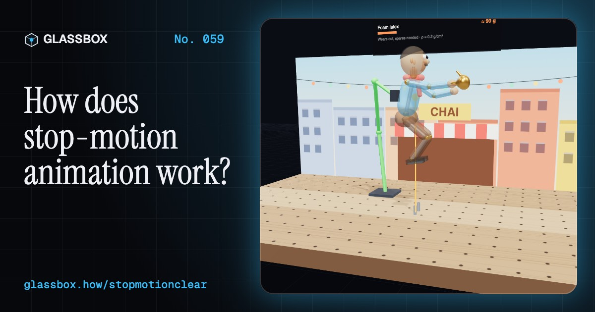
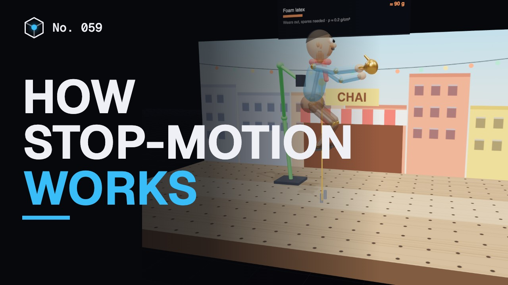
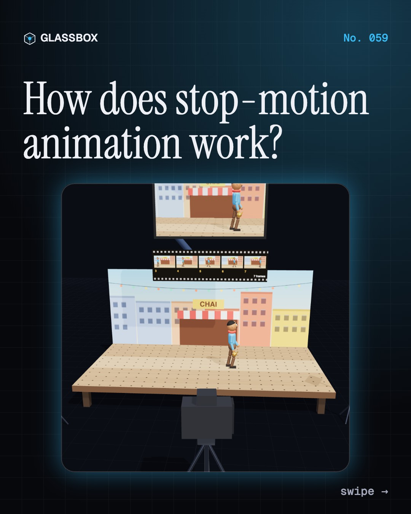
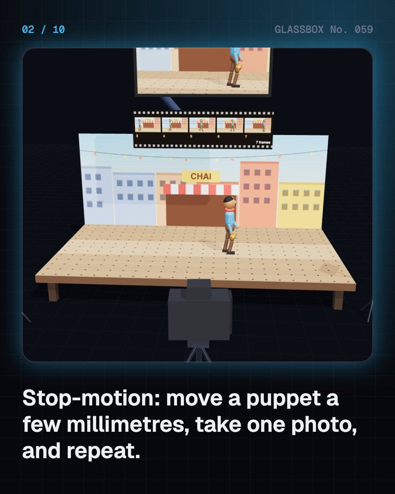
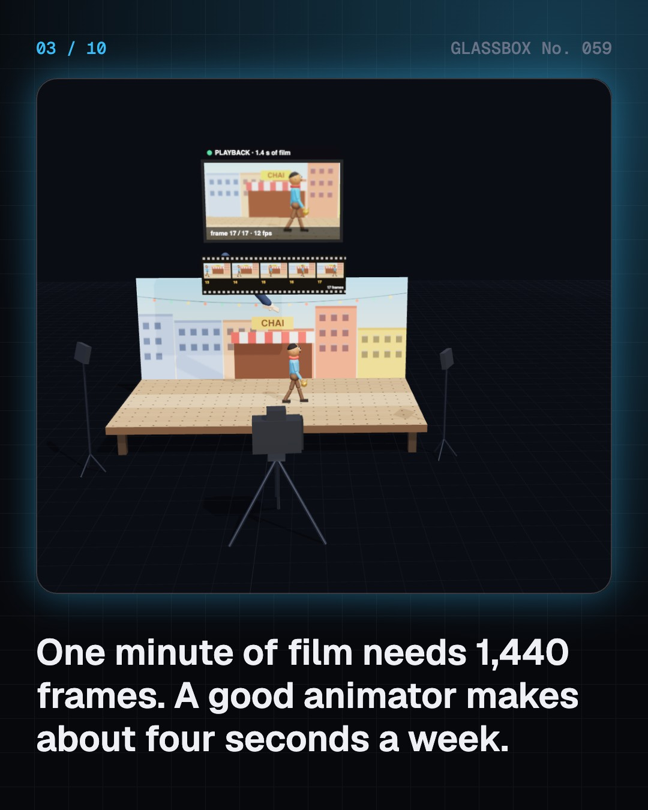
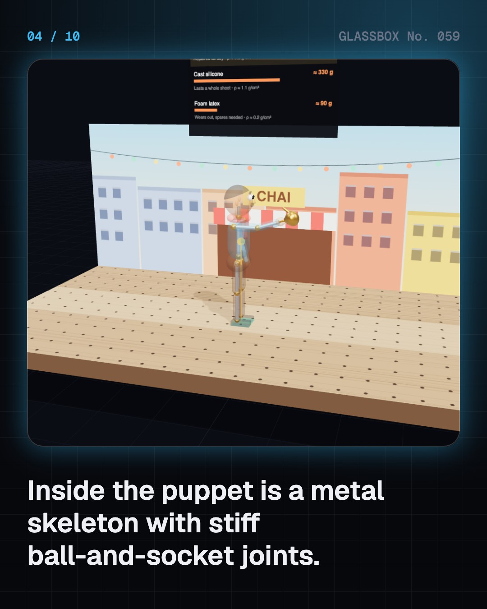

<!-- glassbox:start -->
<!-- Generated from glassbox.json by the Glassbox hub (npm run readme -- stopmotionclear). Edit glassbox.json, not this block. -->
<p align="center"><a href="https://glassbox-production-fd52.up.railway.app/e/stopmotionclear/"></a></p>

<h1 align="center">StopMotionClear</h1>

<p align="center"><b>How does stop-motion animation work?</b><br>One minute of stop-motion is 1,440 photos, and a good animator makes about four seconds a week. Nudge a clay chai-wallah frame by frame, look inside his metal skeleton, make him talk with swapped mouths, ghost the last frames with onion skin, and plan your own film on a phone.</p>

<p align="center"><a href="https://glassbox-production-fd52.up.railway.app/stopmotionclear/"><b>▶ Play with it</b></a> &nbsp;·&nbsp; <a href="https://glassbox-production-fd52.up.railway.app/e/stopmotionclear/">Read the 60-second explainer</a> &nbsp;·&nbsp; <a href="https://glassbox-production-fd52.up.railway.app/stopmotionclear/glassbox/reel.mp4">Watch the 40-second video</a></p>

<p align="center">
  <a href="https://glassbox-production-fd52.up.railway.app/e/stopmotionclear/"></a>
  <a href="https://glassbox-production-fd52.up.railway.app/e/stopmotionclear/"></a>
  <a href="LICENSE"></a>
  <a href="LICENSE-CONTENT.md"></a>
  <a href="#privacy"></a>
</p>

## In 60 seconds

1. **One frame at a time.** An animator moves a puppet a few millimetres, steps away, and the camera takes one photo. Played back at 24 frames a second the photos become motion. Animating on twos (12 poses a second) still needs 720 poses a minute. An Aardman animator makes about 4.2 seconds of film a week; on Coraline, 29 animators made 90 to 100 seconds a week together.
2. **Puppets and armatures.** Inside a puppet is a metal skeleton with ball-and-socket joints, tightened so they hold any pose. The skin is clay, cast silicone or foam latex. Tie-down screws or magnets hold the feet when the centre of mass is not over them, and rigs hold jumps, painted out later in VFX.
3. **Faces that talk.** Animators match about eight mouth shapes to the voice, frame by frame. They either re-sculpt the clay each frame or swap in pre-made mouths (replacement animation). LAIKA 3D-printed about 20,000 faces for Coraline and 102,000 for Missing Link.
4. **Onion skin and flicker.** Frame-grab software shows the live camera view with the last frames ghosted over it, so the animator can check spacing: a falling ball should speed up. Frames are shot minutes apart, so daylight, auto exposure or a bumped tripod make flicker. Blackout, lamps, manual exposure and a locked-off camera fix it.
5. **Not only puppets.** Cut-out paper on multiplane glass (Lotte Reiniger, 1926), pixilated people (Norman McLaren's Neighbours, 1952), dancing matchsticks (Dadasaheb Phalke, 1915) and sand on a light box (Caroline Leaf, 1969) all use the same trick.
6. **Make your own.** A phone on a tripod, a lamp and some clay are enough. A 5-second clip at 12 fps is 60 photos. Tape the tripod down, keep your hands off the phone, lock exposure, shut the curtains and stick the puppet down.

## Words worth knowing

| Term | Meaning |
|---|---|
| **Frame** | One photo in the film; cinema shows 24 a second. |
| **On twos** | Holding each pose for two frames, so there are 12 new poses a second at 24 fps. |
| **Armature** | The posable metal skeleton inside a puppet, with stiff ball-and-socket joints. |
| **Tie-down** | A screw or magnet that locks a puppet's foot to the set. |
| **Replacement animation** | Swapping pre-made pieces, such as mouths or faces, between frames. |
| **Lip sync** | Matching mouth shapes to the sounds of the voice, frame by frame. |
| **Onion skin** | Faded copies of earlier frames shown over the camera's live view. |
| **Spacing** | How far something moves from one frame to the next. |
| **Pixilation** | Stop-motion animation of real people, who pose for every frame. |

## A short history

**130 years of moving things a little and taking a photo: from wooden circus toys and beetles to 3D-printed faces and wool.**

- **1898** · Toy acrobats in The Humpty Dumpty Circus (J. Stuart Blackton and Albert E. Smith (attributed), New York, USA)
- **1910** · Stag beetles that fight (Ladislas Starewicz, Kaunas, Lithuania (then Russian Empire))
- **1915** · Dancing matchsticks in India (Dadasaheb Phalke, Nashik, India)
- **1925** · Dinosaurs meet live actors in The Lost World (Willis O'Brien, with models by Marcel Delgado, Hollywood, USA)
- **1926** · A feature cut from paper (Lotte Reiniger, Berlin, Germany)
- **1933** · King Kong (Willis O'Brien and team, Hollywood, USA)
- **1953** · Harryhausen's split-screen monsters (Ray Harryhausen, Los Angeles, USA)
- **1989** · Wallace, Gromit and talking zoo animals (Nick Park, Aardman, Bristol, UK)

The full story, with 28 moments, charts, people and 33 sources: [glassbox.how/e/stopmotionclear/history](https://glassbox-production-fd52.up.railway.app/e/stopmotionclear/history/). The data lives in [`history.json`](history.json).

## Video and slides

Made with the Glassbox studio from this box's storyboard (`window.glassbox.director`). Free to reuse under CC BY 4.0.

<a href="https://glassbox-production-fd52.up.railway.app/stopmotionclear/glassbox/video.mp4"></a>

<p><a href="glassbox/slide-1.jpg"></a> <a href="glassbox/slide-2.jpg"></a> <a href="glassbox/slide-3.jpg"></a> <a href="glassbox/slide-4.jpg"></a></p>

| File | What | Size |
|---|---|---|
| [`glassbox/reel.mp4`](https://glassbox-production-fd52.up.railway.app/stopmotionclear/glassbox/reel.mp4) | Reel / Short, with captions and soundtrack | 1080×1920 |
| [`glassbox/video.mp4`](https://glassbox-production-fd52.up.railway.app/stopmotionclear/glassbox/video.mp4) | YouTube video, with captions and soundtrack | 1920×1080 |
| `glassbox/slide-1…10.jpg` | Instagram carousel | 1080×1350 |
| `glassbox/thumb.jpg` | YouTube thumbnail | 1280×720 |
| `glassbox/cover.jpg` | Share card and repo social preview | 1200×630 |
| [`glassbox/history-reel.mp4`](https://glassbox-production-fd52.up.railway.app/stopmotionclear/glassbox/history-reel.mp4) | “History in 10 moments” Reel / Short | 1080×1920 |
| `glassbox/history-slide-*.jpg` | History carousel | 1080×1350 |
| `glassbox/post.json` | Post copy and schedule used by the publish kit | |

## Privacy

This box has no accounts and no ads, and it ships its own fonts and libraries. When you run it yourself it sends nothing anywhere. On glassbox.how, the site's `/bar.js` also loads Glassbox's analytics: **Google Analytics** to count visits (it asks first in the EU, UK and Switzerland, and stays off when your browser sends Global Privacy Control or Do Not Track) and **ClickTrust** to detect bots.

It remembers a few things **in your own browser only**, and never sends them anywhere:

| Browser storage key | What it holds |
|---|---|
| `stopmotionclear.v1` | Which chapters you have opened, your best quiz scores, and sound on or off. |

Exactly what each one sees is at [glassbox.how/privacy](https://glassbox-production-fd52.up.railway.app/privacy/).

## Licences

- **Code:** [MIT](LICENSE). Use it, change it, ship it.
- **Explanations, text, images and videos** (`glassbox.json`, `glassbox/`): [CC BY 4.0](LICENSE-CONTENT.md). Credit “Glassbox, glassbox.how/e/stopmotionclear”.
- **Third-party parts** keep their own licences: [three.js](https://threejs.org) (MIT), [Geist, Instrument Serif](https://openfontlicense.org) (SIL OFL 1.1).
- The Glassbox name and logo aren't covered by either licence. See the [terms](https://glassbox-production-fd52.up.railway.app/terms/).

Found a mistake? [Open an issue](https://github.com/bdeeps/stopmotionclear/issues). Corrections happen in public.
<!-- glassbox:end -->

## Run it

It's plain HTML, CSS and JavaScript. No build step and no dependencies. Run locally, it contacts no other website.

```bash
python3 -m http.server 8000
```

Three.js and the fonts ship in `vendor/` and `fonts/`, so it also works offline.

Then open http://localhost:8000.

## How it's built

| File | What |
|---|---|
| `index.html`, `css/app.css` | The page and its styles |
| `js/app.js`, `js/stage.js`, `js/ui.js`, `js/kit.js` | The shared Glassbox 3D engine: chapters, 3D stage, controls, quiz, video director |
| `js/chapters/*.js` | One file per chapter: the 3D model, controls, text, key terms, quiz and video scenes |
| `js/stopmo.js` | Shared parts: the tabletop set, stills camera and monitors, the clay puppet with its armature, replacement mouths, the Web Audio voice and chart boards |
| `glassbox.json` | Title, question, explainer beats, key terms, browser storage and credits shown on glassbox.how |
| `reel` in each chapter | The storyboard the Glassbox studio records into short videos |
| `glassbox/` | The published video, slides, thumbnail and post copy |
| `fonts/`, `vendor/three/` | Self-hosted Geist and Instrument Serif (SIL OFL 1.1) and three.js (MIT) |
